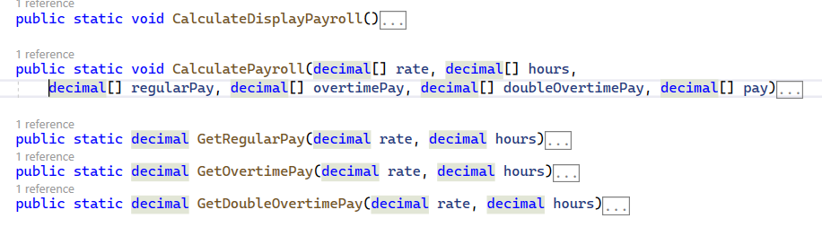

# Assignment 1 - 2P6 

* **Worth**: 6%
* 📅 **Due**: February 8, 2023 @ 23:59
* 🙅🏻 **Penalty**: Late submissions lose 10% per day to a maximum of 3 days. Nothing is accepted after 3 days and a grade of 0% will be given

* 📥**Submission**: Submit the whole Visual Studio project on Moodle.

---

In this assignment you will create a program with a menu that will take the user to the proper menu option that is a method you will write in one of the below assignment questions.

##### Menu Requirements

1. Create the below menu.

2. Validate the user input: Accept only a number within the displayed options and print the message properly (in red).

   

3. When the user enters a valid input number, take the user to the corresponding problem.

4. The menu should be displayed until the user enters 5.

---

##### Problem 1: 3D Printing Estimator

This program gives an estimate on how much the 3D printing activity planned for the 2T3 course would cost us this semster. 

* One spool of filament prints 1KG of objects.

* Filament spools are sold in units of 1 KG.

* One spool of filament is at least 35.00$.

  After creating a 3D model, every student feeds their STL file to a slicer software to create G-Code. The slicer calculates an estimated weight and time of the 3D print based on the type of material to be used.

Write a method **PrintJobEstimator()** that after taking the required information, displays an estimate on printing the 3D objects.

1. The method should call 7 other methods :

   1. int **GetNumberOfStudents()**

      1. Asks the user to enter the number of students in class.
      2. Validates that the number of students is not less than 1.
      3. Returns the value.

   2. decimal **GetPricePerSpool()**

      1. Asks the user to enter the price of a spool of filament.
      2. Validates that the price is not less than $35.00.
      3. Returns the value.

   3. float **GetTotalWeight(int numberofStudents)**

      1. Asks the user to enter the weight estimate of the print of every student (in grams).
      2. Validates that the weight is not a negative number.
      3. Calculates and returns the total weight.

   4. int **GetSpoolsOfFilament(float totalWeight)**

      1. Calculates and returns the number of spools needed. 

         > The number of spools is an estimate

   5. decimal **GetPrintCost(int spoolsOfFilament, decimal pricePerSpool)**

      1. Calculates and returns the cost of the filament.

   6. int **GetTotalHours(int numberOfStudents)**

      1. Asks the user to enter the time estimate in minutes of the print of every student.
      2. Validates that the time is not a negative number.
      3. Calculates and returns an estimate of the total time in hours.

   7. void **PrintCost(float totalWeight, int spoolsOfFilament, decimal pricePerSpool, decimal printCost, int numberOfHours)**

      1. Displays:

         * The total weight

         * The number of spools of filament required

         * The price per spool

         * The cost of the print

         * The hours required to print all objects

           

           

           

           

           **Use the method names, return types, argument names and argument types shown. below**

           

2. The last step the method executes should be a pause asking the user to press a key to continue.

---

##### Problem 2: Rent Prices

Rent prices in Montreal are increasing by 2.3% this year. Write a program that calculates and displays how much extra a person would pay for rent over a period of time if rent prices keep increasing by 2.3% every year.

1. Write a method **RentPrices()** that calls 3 other methods:

   1. int **GetNumberOfYears()**

      1. Asks the user to enter the number of years.
      2. Validates input. Accepts numbers greater than zero.
      3. Returns the value.

   2. decimal **GetRentPrice()**

      1. Asks the user to enter the current Price of rent.
      2. Validates input. Accepts prices greater than zero.
      3. Returns the value.

   3. void **DisplayTable(int numberOfYears, decimal rentPrice)**

      1. Performs the proper calculations and displays the output in a tabular format with proper alignment.

      2. A loop must be used.

         


> note if it crashes

**Use the method names, return types, argument names and argument types shown below**


2. The last step the method executes should be a pause asking the user to press a key to continue.

---

##### Problem 3: Rock Paper Scissor

This program lets the user play the game of Rock Paper Scissor against the computer.

Write a method **RPSGame()** that:

1. When the program begins, a random number in the range of 1 to 3 is generated. If the number is 1, then the computer has chosen rock. If the number is 2, then the computer has chosen paper. If the number is 3, then the computer has chosen scissor. 
2. Display a menu, so that the user selects its own choice. Validate input.
3. Display the choice of the computer.
4. The winner is selected and displayed based on the following rules: 
   1. If one player chooses rock and the other player chooses scissor, then rock wins. (The rock smashes the scissor.)
   2. If one player chooses scissor and the other player chooses paper, then scissor wins. (Scissor cuts paper.)
   3. If one player chooses paper and the other player chooses rock, then paper wins. (Paper wraps rock.)
   4. If both players make the same choice, the game must be played again to determine the winner. 
5. The game keeps playing until the user quits, as shown in the screenshot below. 
6. Show the game result in the colors below. 
7. Use enum.


​	**Use the method names, return types, argument names and argument types shown below**


7. The last step the method executes should be a pause asking the user to press a key to continue.

---

##### Problem 4: Payroll Calculator

This program calculates and displays the weekly payroll of the employees at a company.

The employee names, hourly rate, and hours worked are stored in parallel arrays.

The program should calculate the different payroll portions and the total payroll of every employee and store it in the corresponding parallel array according to the following formula: 

`totalPay = regularPay + overtimePay + doubleOvertimePay `  where

* `regularPay` is the amount paid for the first 40 hours (inclusive) of work.
* `overTimePay` is the amount paid for the hours worked over 40 hours and up to 60 hours (inclusive). The rate per hour is 1.5 the regular hourly rate.
* `doubleOvertimePay` is the amount paid for the hours worked over 60 hours. The rate per hour is twice the regular hourly rate.

Write a method **CalculateDisplayPayroll()** that creates and populates the arrays given below.

```c#
string[] employees = { "Marcus", "Ethan", "Philip", "Julien", "Naomie", "Rayane" };
decimal[] rate = { 16.75m, 23.95m, 18.18m, 21.00m, 24.50m, 25.71m };
decimal[] hours = {0.0m,22.0m,40.0m,51.0m,60.0m,71.8m};
```

The method should:

1. Call **CalculatePayroll(..)** method and pass the required arrays. 

   This method calculates the different payroll portions and the total payroll of every employee by calling **GetRegularPay(decimal rate, decimal hours)**, **GetOvertimePay(decimal rate, decimal hours)**, and **GetDoubleOvertimePay(decimal rate, decimal hours)** methods.

2. Displays the payroll details as shown below.

   

   

   ​	**Use the method names, return types, argument names and argument types shown below**

   

   

3. The last step the method executes should be a pause asking the user to press a key to continue.

   

---

##### Comments and Testing

* The Main program should be documented with a  general header:

  ```csharp
  /*	Program name: Programming 2: Assignment 1 Winter 2023 
      Created by: Your name 
      Date:
      General description of the program    */ 
  ```

  * Convention is to use the block comments.
    * Begin with `/*` and end with `*/`.

* A method should always be documented by writing comments that appear just before the method’s header.
  * The comments should provide a brief explanation of the method’s purpose. What the method is doing.

  * Convention is to use the block comments.

    * Begin with `/*` and end with `*/`.

  * For each Question, put a comment: 

    ```csharp
    /*	Problem #1: Program Title 
        What the program does in your own words. 
        Tester: Bob Doe (student in class).    */ 
    ```

  * Organize your methods or functions using comments to separate between questions.

    ```csharp
    // Question 1 a
    
    some code
        
    // Question 1 b
        
    some code
    ```

Consequently, each and every student should find a tester (a classmate) that tests their code. You only send the executable file to the tester that is in `\bin\Debug\net6.0` 

---

| Rubric👩‍🏫                                                     | ⚡Consult the rubric while working and before you submit⚡     |
| ------------------------------------------------------------ | ------------------------------------------------------------ |
| Late Penalty                                                 | 1 Day: -0.6points;  2 Days: -1.2 points; 3 Days: -1.8 points |
| **Menu** (0.5 points)                                        | Reproduced properly and displayed until user wants to quit.  |
|                                                              | Input validated, message displayed properly, and proper methods called. |
| **3D Printing Estimator** (1.5 points)                       | `PrintJobEstimator()` implemented properly. `GetNumberOfStudents()`, `GetPricePerSpool()`, `GetTotalWeight(int numberOfStudents)` input validated and returned. (0.25 points) |
|                                                              | `GetSpoolsOfFilament(float totalWeight)` implemented properly. (0.5 points) |
|                                                              | `GetPrintCost(...)` and `GetTotalHours(int numberOfStudents)` implemented properly. (0.25 points) |
|                                                              | `PrintCost(..)` information displayed in proper format (0.5 points) |
| **Rent Prices** (1.5 points)                                 | `RentPrices()` implemented properly; `GetNumberOfYears()` and `GetRentPrice()` input validated and returned. (0.25 points) |
|                                                              | `DisplayTable(int numberOfDays)` calculations done correctly, displayed properly, and a loop used. (1.25 points) |
| **Rock, Paper and Scissor** (1 points)                       | `RPSGame()` implemented properly, methods called, and menu displayed. Game keeps playing till user chooses to quit. (0.25 points) |
|                                                              | `getComputerChoice()` a random number generated in the proper range; `getUserChoice()` input validated. (0.25 points) |
|                                                              | `DetermineWinLoss` winner selection implemented correctly and enum used. (0.5 points) |
| **Payroll Calculator** (1.5 points)                          | `CalculateDisplayPayroll()` implemented properly and displays the payroll details. (0.25 points) |
|                                                              | `CalculatePayroll(..)` implemented correctly. (0.5 points)   |
|                                                              | `GetRegularPay(...)`, `GetOvertimePay(...)`, and `GetDoubleOvertimePay(..)` implemented correctly. (0.75 points) |
| **Last step of every method is a pause**                     | -0.5 to -1 points                                            |
| **magic numbers, constants, naming conventions, comments **  | -0.25 to -1 points                                           |
| **Compliance with method names, return types, parameters and their types** | -0.25 to -1 points                                           |

